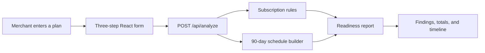

# Subscription Launchpad

Subscription Launchpad is a small planning tool for merchants who want to check a subscription offer before launching it. A merchant enters the product price, discount, billing and delivery timing, shipping threshold, expected subscribers, and available inventory. The app returns a launch-readiness report and a 90-day schedule.

The project is intentionally simple. It demonstrates commerce logic, API design, validation, testing, and a clear user workflow without connecting to a real store or payment system.

## How it works



The rules engine checks whether:

- the discount leaves a valid positive price;
- the discounted price changes free-shipping eligibility;
- billing and delivery happen on different schedules; and
- available inventory covers the next 90 days.

The schedule builder also estimates billing events, deliveries, revenue, and inventory usage during the preview period.

## Run locally

Requirements: Node.js 22.13 or newer.

```bash
npm install
npm run dev
```

Open `http://localhost:3000`.

## Verify the project

```bash
npm run lint
npm test
```

The tests cover the subscription rules, schedule calculations, API-ready analysis, and rendered page output.

## Technology

- TypeScript and React
- Next-compatible API route through Vinext
- Deterministic business rules
- Node test runner and TSX
- Cloudflare Workers-compatible deployment

## Project scope

This portfolio project does not process payments, change store data, or require a Shopify account. Its inputs are sample planning data, so it can be used as a general subscription-commerce prototype rather than a Shopify-only application.
